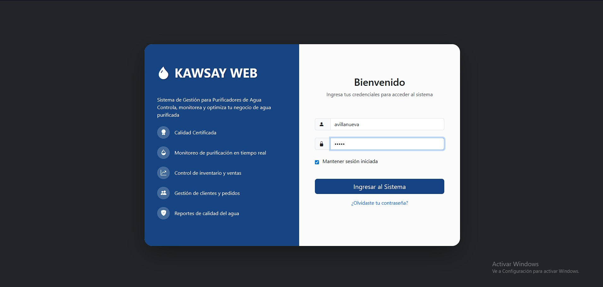
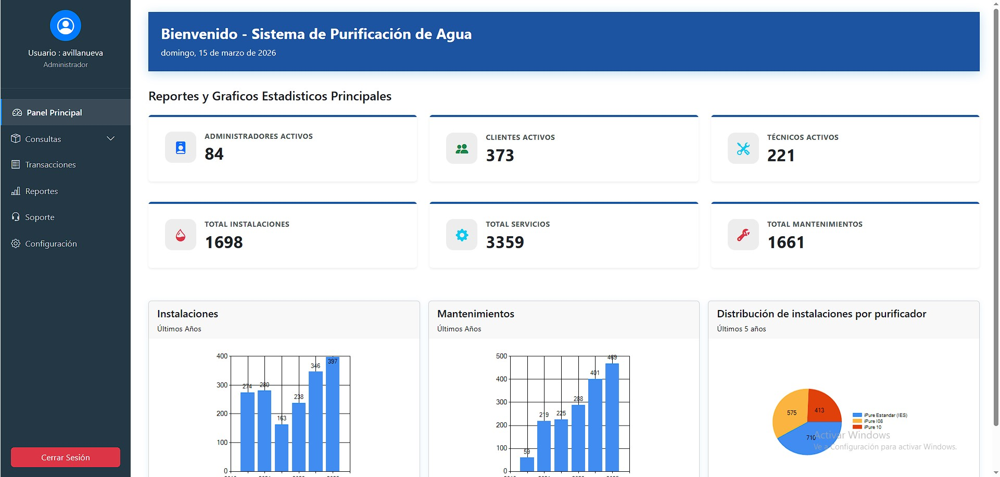

# Kawsay - Sistema de Gestión para Servicios de Purificación de Agua

Aplicación web empresarial desarrollada en **C# con ASP.NET Web Forms**, orientada a la gestión operativa y administrativa de servicios de **instalación**, **mantenimiento**, **programación técnica** y **reportes de viaje** para una empresa del rubro de purificación de agua.

## Descripción del proyecto

Kawsay es un sistema diseñado para centralizar la información de clientes, técnicos, vehículos, servicios e indicadores operativos. La aplicación permite autenticación de usuarios, consultas detalladas, registro de programaciones y visualización de reportes estadísticos desde un panel principal.

## Características principales

- Inicio de sesión para administradores
- Dashboard con métricas y gráficos estadísticos
- Consulta de historial por cliente
- Consulta de historial por técnico
- Registro de programaciones de servicio
- Reportes de viajes por vehículo y rango de fechas
- Arquitectura por capas
- Integración con SQL Server mediante Entity Framework

## Módulos del sistema

### 1. Autenticación
Permite validar usuarios activos mediante login y contraseña.

### 2. Panel principal
Muestra indicadores como:
- administradores activos
- clientes activos
- técnicos activos
- total de instalaciones
- total de servicios
- total de mantenimientos

Además, presenta gráficos estadísticos para apoyar la toma de decisiones.

### 3. Consultas por cliente
Permite buscar un cliente por código y rango de fechas para visualizar:
- datos generales del cliente
- ubicación
- estado
- total de instalaciones y mantenimientos
- historial de servicios realizados

### 4. Consultas por técnico
Permite buscar un técnico por código y rango de fechas para visualizar:
- datos generales del técnico
- licencia
- especialidad
- ubicación
- cantidad de instalaciones y mantenimientos realizados
- detalle de servicios ejecutados

### 5. Transacciones de programación
Permite registrar programaciones de trabajo asociando:
- técnico
- clientes
- fecha de visita
- tipo de servicio
- observaciones

Incluye validaciones para evitar inconsistencias al registrar detalles.

### 6. Reportes de viaje
Permite consultar reportes de viaje por vehículo y rango de fechas, mostrando:
- placa
- marca
- modelo
- número de serie
- estado del vehículo
- técnico responsable
- incidencias y estado del viaje

## Tecnologías utilizadas

- **Lenguaje:** C#
- **Framework:** .NET Framework 4.8
- **Frontend:** ASP.NET Web Forms, HTML, CSS, Bootstrap 5
- **ORM:** Entity Framework 6
- **Base de datos:** SQL Server
- **IDE recomendado:** Visual Studio 2022

## Arquitectura del proyecto

La solución está organizada en capas:

- `ProyKawsay_BE` → entidades de negocio
- `ProyKawsay_ADO` → acceso a datos
- `ProyKawsay_BL` → lógica de negocio
- `SitioWeb_KawsayGUI` → interfaz web

## Estructura general

```bash
Kawsay_Proyecto/
├── ProyKawsay_BE/
├── ProyKawsay_ADO/
├── ProyKawsay_BL/
├── SitioWeb_KawsayGUI/
├── packages/
└── Kawsay_Proyecto.sln
```

## Base de datos

El proyecto utiliza una base de datos SQL Server llamada `BD_Kawsay`.

## Configuración local

1. Clonar el repositorio.
2. Abrir la solución en Visual Studio.
3. Restaurar paquetes NuGet.
4. Crear o restaurar la base de datos en SQL Server.
5. Actualizar la cadena de conexión en:
   - `SitioWeb_KawsayGUI/Web.config`
   - `ProyKawsay_ADO/App.Config`
6. Ejecutar el proyecto web desde IIS Express o Visual Studio.

## Cadena de conexión

Antes de ejecutar, reemplaza la conexión local del proyecto por la de tu equipo:

```xml
<add name="BD_KawsayEntities"
     connectionString="metadata=res://*/Kawsay.csdl|res://*/Kawsay.ssdl|res://*/Kawsay.msl;provider=System.Data.SqlClient;provider connection string=&quot;Data Source=TU_SERVIDOR;Initial Catalog=BD_Kawsay;Integrated Security=True;MultipleActiveResultSets=True;App=EntityFramework&quot;"
     providerName="System.Data.EntityClient" />
```

## Capturas del sistema

### Login


### Dashboard


## Aprendizajes demostrados

Este proyecto evidencia conocimientos en:
- desarrollo de aplicaciones empresariales
- separación por capas
- consultas y validaciones de negocio
- manejo de sesiones
- integración con base de datos relacional
- construcción de interfaces administrativas
- reportes y visualización de datos

## Estado del proyecto

Proyecto académico / portafolio.

## Autor

**Aarom Villanueva**

Si deseas, este repositorio puede complementarse con documentación adicional como:
- diagrama de arquitectura
- modelo entidad-relación
- casos de uso
- manual técnico
- manual de usuario
